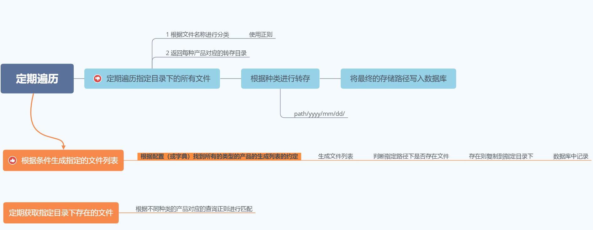

读取的预报产品数据存储在指定 ftp 目录下

项目目录结构：

<pre><code>
├──README.MD  
├── common                      <= 一些通用的方法及枚举放置于此(枚举之后也许会单独分出一个package)
│ ├── enum.py                   <= 枚举
│ ├── tools.py                  <= 部分公共的工具方法放于此处
├── conf        				<= 配置文件  
├── core  						<= 核心代码 
│ ├── ftp.py                    <= ftp相关操作
├── model  						<= orm的model以及middle model放置于此
├── main.py  					<= 项目入口文件 

</code></pre>

---
[进度](./SCHEDULE.md)  

---  

# 处理产品的相关逻辑如下图

1. 定期遍历指定目录  
    所有文件的所在根目录(root_path)是相同的均为（showimgdata）  
   1 从预报产品(product_info)表中遍历(一共应该有 9 种)所有的产品 info  
   2 根据 re 判断符合条件的 file list  
   3 根据存储信息（store_info）表中的信息找到该 file list 对应的存储路径 dir_list
2. 将文件集合复制至新的路径下  
   1 targetpath/yyyy/mm/dd/  
   2 根据 fille_list 与 dir_list，以及当前的时间(yyyy/mm/dd)将 file_list 遍历并复制到目标路径下
3. 将文件记录写入数据库  
   1 将文件相关信息写入文件信息表(file_info)

1. 加载条件  
   起止时间  
   产品种类(type)  
   区域（area）
2. 从相关各表检索出预报产品(product_info)  
   1 根据 area 从 common_area 表中找到符合的对象  
   2 根据 type 从 product_type 表中找到符合的对象  
   3 从 product_info 中根据 areaid 与 typeid 找到符合条件的对象（唯一）
3. 根据 product_info 从 file_info 表中找到文件相关信息  
   根据 pid 从 file_info 表中找到符合条件的对象
4. 返回对应的产品所在路径(图片)  
   将 product_info 返回

# 与产品相关的数据库设计如下:

# 之后的修改

图片分发流程，采用方式 2

采取了定时根据种类字典（不用根据种类-区域）获取对应产品的文件匹配规则  
       获取 ftp 中符合条件的 file list  
       将制定的 file list 复制到本地指定目录下  
       - 未完待续  
      
      
- [x] 数据名称规范如下
      
      

